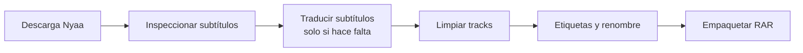

# Media Workflow Orchestrator

Aplicación de escritorio en WinUI 3 para orquestar un flujo local de descarga, inspección, traducción, limpieza, renombre y empaquetado multimedia desde una sola ventana.

Está pensada para un caso real de trabajo en Windows donde ya existen scripts operativos en Python y se necesita una capa de control visual, persistencia de estado y ejecución ordenada, sin reescribir la lógica principal de cada herramienta.

## Qué resuelve

- Centraliza varios scripts locales en un solo panel.
- Muestra el estado del workflow paso por paso.
- Permite continuar workflows previos sin perder contexto.
- Guarda logs por paso y salida en vivo dentro de la UI.
- Detecta si hay subtítulos en español y evita traducir cuando no hace falta.
- Permite saltar pasos y ejecutar directamente `Empaquetar RAR` cuando el release ya está listo.
- Expone flags rápidos por paso desde el dashboard.
- Maneja casos prácticos como:
  - archivo final único listo para RAR
  - staging previo en `Completado`
  - lanzamiento de FileBot desde el paso de renombre
  - contraseña RAR protegida con DPAPI

## Flujo general



También puede usarse de forma parcial. Por ejemplo:

- cargar archivo base y saltar directo a `Empaquetar RAR`
- ejecutar solo `Descarga semanal`
- usar `Descargar desde link de Nyaa`
- retomar un workflow fallido desde el paso exacto

## Scripts que orquesta

La app no reemplaza estos scripts. Los ejecuta, valida y monitorea.

| Paso | Script |
|---|---|
| Descarga semanal | `auto_backup_nyaa.py` |
| Descarga directa por link | `source_from_link.py` |
| Traducción de subtítulos | `traducir_subtitulos.py` |
| Limpieza de tracks | `limpiar_tracks.py` |
| Etiquetas y renombre | `ETIQUETAS_GDRIVELATINO.py` |
| Empaquetado / capturas / RAR | `rar_folder_image_info.py` |

## Características principales

- Shell WinUI 3 unpackaged sobre `.NET 8`
- Navegación por `Dashboard`, `Herramientas` e `Historial`
- Persistencia de workflows en `%LocalAppData%\MediaWorkflowOrchestrator`
- Logs por paso en `%LocalAppData%\MediaWorkflowOrchestrator\logs`
- Configuración persistente de rutas y flags
- Fondo visual dinámico con gradientes y capas animadas
- Acciones rápidas en panel lateral
- Opciones rápidas por paso en el dashboard
- Reglas de negocio centralizadas en un motor de workflow

## Requisitos

- Windows 10/11
- .NET SDK 8
- PowerShell
- Python disponible en el sistema
- Los scripts locales que usa tu flujo
- Dependencias externas según el paso:
  - `mkvmerge`
  - `mkvpropedit`
  - `rar.exe`
  - `ollama.exe`
  - `FileBot` vía `Renombrar.lnk`

## Compilación

Desde la carpeta del proyecto:

```powershell
cd C:\Users\gilbe\MediaWorkflowOrchestrator
dotnet build MediaWorkflowOrchestrator.csproj -p:Platform=x64
```

Ejecutable generado:

```text
bin\x64\Debug\net8.0-windows10.0.19041.0\win-x64\MediaWorkflowOrchestrator.exe
```

## Primer uso

1. Abre la app.
2. En `Herramientas`, valida rutas, binarios y scripts.
3. Ajusta contraseña RAR, ruta de `rar.exe`, `mkvmerge`, `mkvpropedit` y modelo de traducción si aplica.
4. Regresa a `Dashboard`.
5. Elige una de estas entradas:
   - `Elegir archivo base`
   - `Elegir carpeta del release`
   - `Descarga semanal desde Nyaa`
   - `Descargar desde link de Nyaa`

## Uso rápido

### Workflow completo

1. Cargar archivo o carpeta.
2. Revisar el paso recomendado.
3. Ejecutar el siguiente paso o el paso seleccionado.
4. Consultar salida y logs.
5. Empaquetar RAR al final.

### Solo empaquetar RAR

1. Cargar el archivo base o la carpeta final.
2. Seleccionar `Empaquetar RAR`.
3. Activar o desactivar flags rápidos.
4. Usar `Saltar previos y ejecutar ahora`.

La app entiende el caso donde solo existe una carpeta final con videos directos y construye un contenedor temporal compatible con `rar_folder_image_info.py`.

## Flags rápidos desde el dashboard

### Descarga Nyaa

- `Dry-run`
- `Force latest`

### Traducir subtítulos

- `Modo rápido`
- `Omitir resumen`

### Limpiar tracks

- `Cerrar qBittorrent`

### Empaquetar RAR

- `Sin imágenes`
- `Solo info`
- `Modo RAR: Contenedor fast / Comprimir`
- `Formato imagen: jpg / png`
- `Verbose`

## Dónde guarda datos

```text
%LocalAppData%\MediaWorkflowOrchestrator\
```

Contenido principal:

- `settings.json`
- `workflows\`
- `logs\`
- `rar-input\` para contextos temporales de empaquetado

## Arquitectura

```text
MediaWorkflowOrchestrator
├── Models
├── Persistence
├── Services
├── ViewModels
├── Views
└── Styles
```

### Capas

- `Models`: estado del dominio y configuración
- `Persistence`: settings, secretos y workflows
- `Services`: ejecución de procesos, validación, inspección y reglas auxiliares
- `ViewModels`: lógica de UI y comandos
- `Views`: pantallas WinUI
- `Styles`: tema, colores y recursos visuales

## Estado actual

La V1 ya cubre:

- orquestación local real
- historial y recuperación de workflows
- salida en vivo por paso
- decisiones manuales de traducción
- integración con FileBot vía shortcut
- empaquetado RAR con flags configurables
- salto manual de pasos

## Roadmap sugerido

- capturas de pantalla reales en el README
- exportación de presets de configuración
- detección más rica del resultado de FileBot
- perfiles de workflow por tipo de release
- empaquetado de release en modo `Release`
- icono/logo final de la app

## Licencia

Pendiente de definir.
